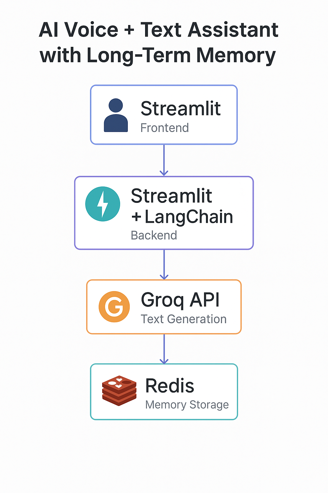

🧠 Voice/Text AI Assistant with Long-Term Memory
Built using Python, LangChain, Groq, Redis, and Streamlit

💡 Project Overview
This project is a custom AI voice and text assistant designed to simulate real-time conversational intelligence. It integrates Groq’s LLaMA models for fast, low-latency reasoning, Redis for long-term memory storage, and Streamlit for an interactive UI.
The assistant can:
Understand text or voice inputs from users
Retain context and memory across sessions using Redis
Respond intelligently using Groq-powered LLMs
Run completely on free and open tools
This project demonstrates end-to-end AI application design, covering backend integration, model inference, memory management, and frontend deployment.

🏗️ Tech Stack
Layer	Tool	Purpose
Backend	Python + FastAPI	API for text/voice communication
AI Engine	Groq (LLaMA-3.1)	Handles natural language reasoning
Memory	Redis Cloud	Stores chat history & long-term memory
Framework	LangChain	Manages prompt flows and memory context
Frontend	Streamlit	Web interface for text + voice chat
Speech	SpeechRecognition + pydub	Converts voice input to text

⚙️ Features
✅ Voice & Text Input Support
✅ Context-Aware Conversations
✅ Redis-based Long-Term Memory
✅ Real-Time Groq API Integration
✅ Streamlit-Powered Modern UI
✅ Lightweight, Free, and Extendable

🚀 How It Works
User Input: Speak or type your query on Streamlit UI.
Speech-to-Text: Voice inputs are transcribed using SpeechRecognition.
Memory Retrieval: Redis fetches prior context from stored sessions.
LLM Inference: Query is sent to Groq API for reasoning.
Memory Update: Redis saves the latest conversation context.
Response Display: Streamlit renders the response in text or audio.

🧩 Setup Instructions
Clone the Repository:
git clone https://github.com/your-username/voice-ai-assistant.git
cd voice-ai-assistant
Create a Virtual Environment:
python3 -m venv .venv
source .venv/bin/activate
Install Dependencies:
pip install -r requirements.txt
Set Environment Variables (.env):
GROQ_API_KEY=your_groq_api_key
GROQ_API_URL=https://api.groq.com/openai/v1/chat/completions
REDIS_URL=redis://<your_redis_public_endpoint>
Run the Backend:
uvicorn api_server:app --reload
Run the Frontend:
streamlit run assistant_app.py
Start Chatting:
Open http://localhost:8501 and start speaking or typing! 🎤💬

🎯 Key Learning Outcomes
How to integrate Groq LLM API for real-time reasoning
How to use Redis for persistent, long-term conversational memory
How to design modular AI agents using LangChain
How to build an interactive Streamlit front-end

🧩 Future Enhancements
Add TTS (text-to-speech) for full voice output
Add user-based personalized memory
Include vector database (like FAISS or Chroma) for deeper recall
Deploy on cloud (Render / Hugging Face Spaces / Streamlit Cloud)

🧑‍💻 Author
Muskan Sohaney
AI & Data Science Enthusiast | Software Engineer | IEEE CIS Webmaster

